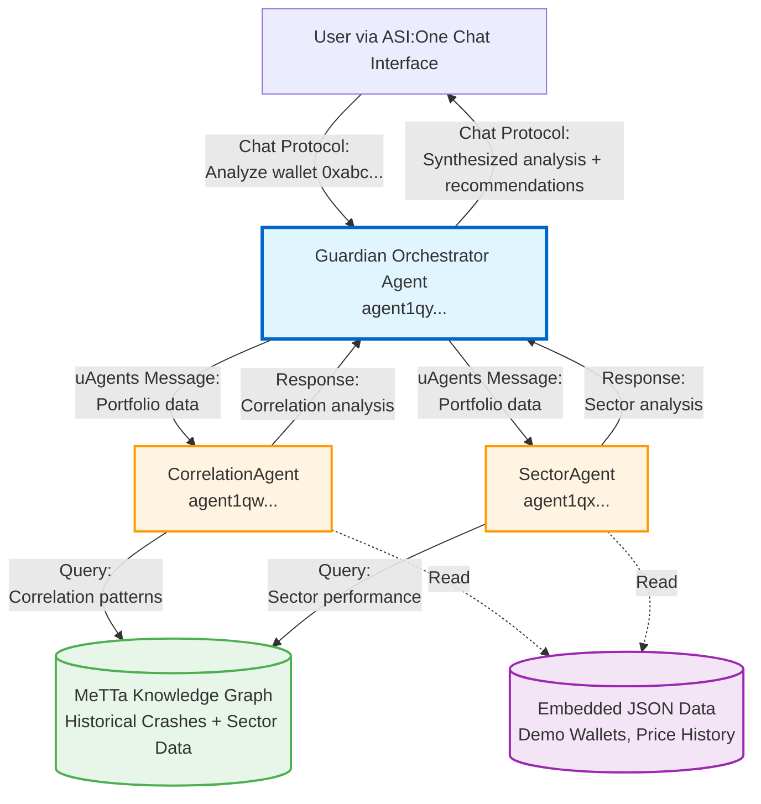
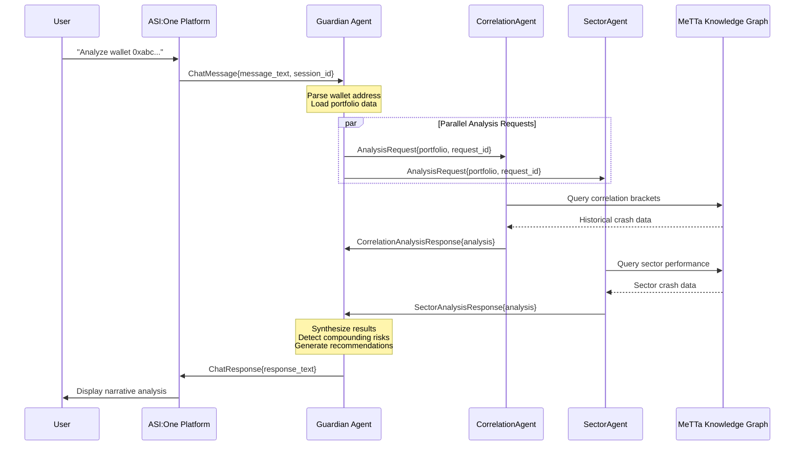
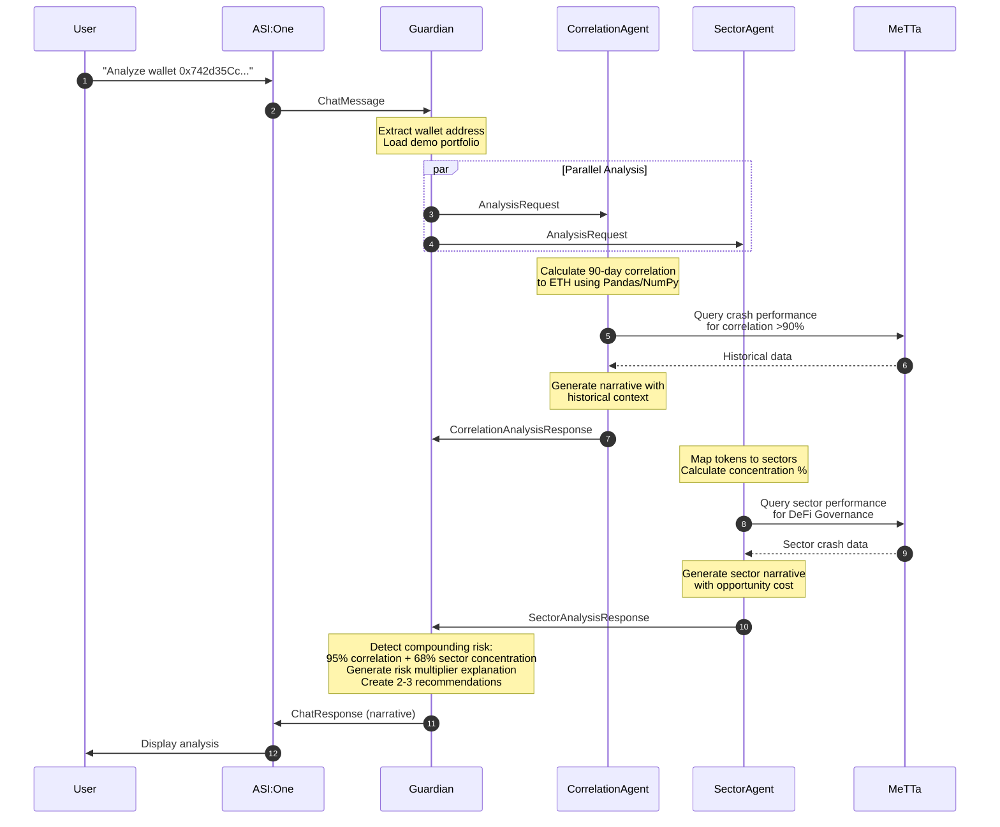

# Guardian Fullstack Architecture Document

**DeFi Portfolio Intelligence Agent**

**Version:** 1.0
**Date:** October 18, 2025
**Status:** Draft - In Progress

---

## Introduction

This document outlines the complete fullstack architecture for **Guardian**, including backend systems, frontend implementation, and their integration. It serves as the single source of truth for AI-driven development, ensuring consistency across the entire technology stack.

This unified approach combines what would traditionally be separate backend and frontend architecture documents, streamlining the development process for modern fullstack applications where these concerns are increasingly intertwined.

### Starter Template or Existing Project

**Status:** N/A - Greenfield Project

Guardian is being built from scratch specifically for the ASI Alliance Hackathon. The project does not utilize any pre-existing starter templates or monorepo frameworks. Instead, it follows a **custom multi-agent architecture** built directly on the uAgents framework (Fetch.ai) with manual repository structure tailored to the unique requirements of distributed agent deployment on Agentverse.

**Constraints:**
- **uAgents framework** (Python-based) is mandatory for hackathon eligibility
- **Agentverse deployment platform** is the hosting environment (not traditional cloud providers)
- **ASI:One Chat Protocol** is required for user-facing conversational interface
- **MeTTa knowledge graph** must be integrated to demonstrate SingularityNET technology

These technology choices are fixed requirements for the ASI Alliance Hackathon and cannot be substituted.

### Change Log

| Date | Version | Description | Author |
|------|---------|-------------|--------|
| October 18, 2025 | v1.0 | Initial architecture document creation | Winston (Architect) |

---

## High Level Architecture

### Technical Summary

Guardian employs a **distributed multi-agent architecture** built on the Fetch.ai uAgents framework, where three autonomous agents collaborate via asynchronous message-passing to deliver portfolio risk intelligence. The system architecture is fundamentally different from traditional web applications: instead of a monolithic backend serving a rich client frontend, Guardian consists of independent agents deployed to Agentverse that communicate through the uAgents protocol.

**Architectural Style:** Agent-Oriented Architecture (AOA) with message-passing communication
**Deployment Approach:** Serverless agent deployment on Agentverse platform (Fetch.ai managed infrastructure)
**Frontend Interface:** Conversational AI via ASI:One Chat Protocol (text-based, no traditional UI framework)
**Backend Technology:** Python 3.10+ using uAgents framework for agent implementation
**Key Integration Points:**
- ASI:One Chat Protocol bridges user input to Guardian orchestrator
- uAgents message protocol enables inter-agent communication (Guardian ↔ CorrelationAgent ↔ SectorAgent)
- Hyperon Python bindings connect agents to MeTTa knowledge graph for historical data queries

**Infrastructure Platform:** Agentverse (Fetch.ai)—managed platform for agent hosting, discovery, and communication

**Alignment with PRD Goals:** This architecture achieves hackathon objectives by demonstrating true multi-agent collaboration (visible, transparent agent interactions), leveraging ASI Alliance technologies (uAgents, MeTTa), and providing conversational intelligence rather than static dashboards. The distributed agent design allows each specialized agent to evolve independently post-hackathon while maintaining clear separation of concerns.

### Platform and Infrastructure Choice

**Context:** Given the ASI Alliance Hackathon constraints, platform selection is predetermined. However, understanding the trade-offs clarifies why this architecture is designed the way it is.

**Platform:** Agentverse (Fetch.ai)

**Key Services:**
- **Agent Hosting:** Continuous agent runtime environment (agents run 24/7 listening for messages)
- **Agent Discovery:** Public agent addresses (agent1qw...) for inter-agent communication
- **Message Routing:** uAgents protocol handles message delivery between agents
- **Monitoring:** Built-in agent health monitoring and logging via Agentverse dashboard

**Deployment Host and Regions:** Agentverse global infrastructure (managed by Fetch.ai, specific regions not controllable by developers)

**Alternative Considered (Hypothetical):**

While not applicable for this hackathon, here's what a traditional architecture comparison would look like:

| Aspect | Agentverse (Chosen) | AWS Full Stack (Alternative) |
|--------|---------------------|------------------------------|
| **Pros** | Zero infrastructure management, native multi-agent support, hackathon required | Full control, mature ecosystem, comprehensive services |
| **Cons** | Limited customization, emerging platform, vendor lock-in | Complex setup, infrastructure overhead, not hackathon eligible |
| **Fit** | Perfect for hackathon, demonstrates bleeding-edge tech | Production-grade but misses hackathon requirements |

**Recommendation:** Agentverse is the only viable choice given hackathon requirements. Post-hackathon, a hybrid approach could deploy critical agents on AWS Lambda while maintaining Agentverse for agent discovery and ASI ecosystem integration.

### Repository Structure

**Structure:** Monorepo (single repository containing all agents, shared code, data, tests, and documentation)

**Monorepo Tool:** Manual organization (no Nx, Turborepo, or Lerna)—Python's native module system handles code sharing via relative imports

**Package Organization:**

```
guardian/
├── agents/                      # Agent implementations
│   ├── guardian.py              # Main orchestrator agent
│   ├── correlation_agent.py     # Correlation analysis specialist
│   ├── sector_agent.py          # Sector concentration specialist
│   └── shared/                  # Shared utilities across agents
│       ├── __init__.py
│       ├── metta_interface.py   # MeTTa query abstraction layer
│       ├── portfolio_utils.py   # Portfolio parsing and data structures
│       └── config.py            # Shared configuration
├── data/                        # Data files embedded with agents
│   ├── demo_wallets.json        # Pre-configured demo portfolios
│   ├── historical_crashes.json  # Market crash scenario data
│   ├── sector_mappings.json     # Token-to-sector classifications
│   └── metta_knowledge/         # MeTTa knowledge graph files (.metta)
├── tests/                       # Test suite
│   ├── __init__.py
│   ├── test_agents.py           # Unit tests for agent logic
│   ├── test_integration.py      # Inter-agent communication tests
│   └── test_metta_queries.py    # MeTTa query accuracy validation
├── docs/                        # Documentation
│   ├── README.md                # Main project documentation
│   ├── prd.md                   # Product requirements (existing)
│   ├── architecture.md          # This document
│   ├── DEMO.md                  # Demo instructions for judges
│   └── sample-responses/        # Expected agent responses for demo wallets
├── scripts/                     # Deployment and utility scripts
│   └── deploy_agents.sh         # Agent deployment automation
├── .env.example                 # Environment variable template
├── .gitignore                   # Git ignore patterns
├── requirements.txt             # Python dependencies (pinned versions)
└── README.md                    # Root readme (duplicates docs/README.md)
```

**Rationale:**
- **Simplicity over tooling:** For a 10-day hackathon with 3 agents, heavyweight monorepo tools add complexity without benefit
- **Shared code via Python imports:** `from agents.shared.portfolio_utils import parse_portfolio` works natively
- **Atomic commits:** Changes affecting multiple agents (e.g., updating MeTTa interface) committed together
- **Judge accessibility:** Single GitHub URL, all code visible in one place, easy to review

### High Level Architecture Diagram



### Architectural Patterns

Guardian leverages multiple architectural patterns across different system layers to balance hackathon constraints (speed, solo developer) with production-quality design principles:

- **Agent-Oriented Architecture (AOA):** Autonomous agents with independent logic and data, collaborating via messages rather than shared state or direct function calls. _Rationale:_ Enables independent agent evolution, natural distribution, and demonstrates true multi-agent intelligence (core hackathon requirement).

- **Message-Passing Concurrency:** Asynchronous communication between agents using uAgents protocol instead of synchronous HTTP requests. _Rationale:_ Decouples agent lifecycles, enables parallel analysis (CorrelationAgent and SectorAgent can work simultaneously), and aligns with actor model best practices.

- **Orchestrator Pattern:** Guardian acts as central coordinator receiving user input, delegating to specialized agents, and synthesizing results. _Rationale:_ Provides single entry point for users, encapsulates multi-agent complexity, and creates clear responsibility separation (orchestration vs. analysis logic).

- **Knowledge Graph Integration:** MeTTa serves as semantic data store for historical crash scenarios and sector relationships. _Rationale:_ Demonstrates SingularityNET technology (hackathon requirement), enables rich queries ("find crashes where correlation >90% AND sector concentration >60%"), and separates domain knowledge from agent code.

- **Conversational Interface Pattern:** Natural language interaction via ASI:One Chat Protocol instead of REST APIs or web forms. _Rationale:_ Lowers user barrier (no wallet connection needed), creates narrative experience (progressive revelation), and showcases agent intelligence rather than UI polish.

- **Embedded Data Pattern:** JSON files and MeTTa knowledge graphs deployed alongside agents rather than external databases. _Rationale:_ Zero infrastructure management, deterministic demo behavior (no API rate limits), fast iteration during hackathon, suitable for read-only analysis use case.

- **Stateless Agents (MVP):** Each analysis request is independent with no session persistence between queries. _Rationale:_ Simplifies agent implementation, avoids state synchronization complexity, acceptable for hackathon demos (post-MVP can add conversation context).

- **Transparent Multi-Agent Collaboration:** Individual agent responses visible to users, not hidden in backend processing. _Rationale:_ Builds trust in analysis, demonstrates multi-agent value to judges, and provides educational transparency showing how specialized intelligence combines.

---

## Tech Stack

This section defines the **complete and authoritative technology stack** for Guardian. All development must use these exact technologies and versions. This is the single source of truth for technology selection—no substitutions without updating this document.

### Technology Stack Table

| Category | Technology | Version | Purpose | Rationale |
|----------|-----------|---------|---------|-----------|
| **Backend Language** | Python | 3.10+ (3.14.0 latest) | Agent implementation, data analysis, all backend logic | uAgents framework requires Python 3.10+; ecosystem has mature libraries (Pandas, NumPy) for portfolio analysis; Python 3.14.0 is latest stable; solo developer proficiency |
| **Agent Framework** | uAgents | 0.22.10 | Core framework for agent implementation and inter-agent communication | Mandatory for ASI Alliance Hackathon; provides native multi-agent architecture, message-passing protocol, and Agentverse deployment integration |
| **Agent Platform** | Agentverse | N/A (Platform) | Agent hosting, discovery, and runtime environment | Fetch.ai's managed platform for agent deployment; zero infrastructure management; hackathon requirement |
| **Conversational Interface** | ASI:One Chat Protocol | Latest | User-facing natural language interface | Hackathon requirement; enables conversational AI interaction; handles UI rendering (no custom frontend needed) |
| **Knowledge Graph** | MeTTa (Hyperon) | 0.2.6 | Semantic storage for historical crash data and sector relationships | SingularityNET technology (hackathon requirement); enables rich semantic queries; separates domain knowledge from code |
| **Knowledge Graph Bindings** | Hyperon Python | 0.2.8 | Python interface to MeTTa knowledge graph | Required to query MeTTa from Python agents; official SingularityNET bindings |
| **Data Analysis** | Pandas | 2.3.3 | Portfolio data manipulation, time-series analysis | Industry standard for financial data analysis; handles historical price data and portfolio calculations efficiently |
| **Numerical Computing** | NumPy | 2.3.4 | Correlation calculations, statistical operations | Foundation for Pandas; optimized numerical operations for portfolio correlation coefficient calculations |
| **Data Storage** | JSON Files | N/A (Standard) | Demo wallets, sector mappings, crash scenarios | Zero infrastructure setup; deterministic demo behavior; version-controlled alongside code; suitable for read-only hackathon data |
| **Database** | None (MVP) | N/A | N/A | No database server for hackathon; embedded JSON files sufficient for demo scenarios; post-MVP: PostgreSQL for user data persistence |
| **Cache** | None (MVP) | N/A | N/A | Agent responses fast enough (<5s) without caching; Agentverse may provide platform-level caching; post-MVP: Redis for historical data |
| **File Storage** | Local File System | N/A | MeTTa knowledge files, JSON data files deployed with agents | Data embedded in agent deployment; no separate object storage needed for hackathon scope |
| **Authentication** | None (MVP) | N/A | N/A | Demo wallets are public addresses; no user accounts or login; ASI:One may handle user sessions; post-MVP: Agentverse identity or OAuth |
| **Testing Framework** | pytest | 8.4.2 | Unit tests, integration tests, all Python testing | Python standard for testing; rich assertion library; fixture support for agent testing; compatible with CI/CD |
| **Testing - Mocking** | unittest.mock | 3.14+ (stdlib) | Mocking uAgents messages and MeTTa queries in unit tests | Python standard library (available since 3.3); no additional dependency; mock 5.2.0 available as backport; sufficient for isolating agent logic during unit testing |
| **Linting** | ruff | Latest | Code quality, style enforcement, fast Python linting | Modern, fast replacement for flake8/black; single tool for linting + formatting; speeds up pre-commit checks |
| **Type Checking** | mypy | 1.18.2 | Static type analysis for Python code | Catches type errors before runtime; important for agent message contracts; improves IDE experience |
| **Dependency Management** | pip + requirements.txt | 25.2 | Python package installation and version pinning | Simple, universally supported; sufficient for monorepo with single Python environment; no need for Poetry/pipenv complexity |
| **Version Control** | Git | 2.51.1 | Source code version control | Industry standard; required for GitHub hosting |
| **Code Hosting** | GitHub | N/A | Repository hosting, judge code review access | Hackathon submission platform; enables judge review; free for public repos |
| **CI/CD** | GitHub Actions | N/A | Automated testing on commit, deployment automation | Free for public repos; integrated with GitHub; YAML-based workflow configuration; can automate agent deployment to Agentverse |
| **Logging** | Python logging | 3.14+ (stdlib) | Agent debugging, inter-agent message tracing | Python standard library; structured logging for agent behavior; critical for debugging message-passing |
| **Monitoring** | Agentverse Dashboard | N/A (Platform) | Agent health monitoring, uptime tracking, message volume | Built into Agentverse platform; sufficient for hackathon; post-MVP: add Sentry for error tracking |
| **Environment Management** | python-dotenv | 1.1.1 | Loading environment variables from .env files | Manages agent addresses, API keys, configuration across dev/production; prevents hardcoded secrets |
| **Documentation** | Markdown | N/A | All project documentation (README, architecture, demo guide) | Universal format; renders on GitHub; hackathon judges expect Markdown docs |
| **Deployment Automation** | Shell Scripts | Bash 5.3 | Agent deployment to Agentverse via CLI | Simple automation for deploying all 3 agents; sufficient for hackathon; post-MVP: migrate to proper IaC |
| **Frontend Language** | N/A | N/A | N/A | No custom frontend—ASI:One provides conversational interface; all user interaction is text-based through Chat Protocol |
| **Frontend Framework** | N/A | N/A | N/A | ASI:One handles UI rendering; Guardian only produces narrative text responses |
| **UI Component Library** | N/A | N/A | N/A | No custom UI components |
| **State Management** | N/A | N/A | N/A | Agents are stateless for MVP; no client-side state management needed |
| **API Style** | uAgents Protocol | N/A | Agent-to-agent communication via message-passing | Not REST/GraphQL/gRPC—agents use native uAgents message protocol with defined message models |
| **Build Tool** | None | N/A | N/A | Python doesn't require compilation; deployment = copying .py files to Agentverse |
| **Bundler** | None | N/A | N/A | No JavaScript bundling; Python modules loaded dynamically |
| **IaC Tool** | None (MVP) | N/A | N/A | Agentverse is fully managed platform; no infrastructure to define; post-MVP: Terraform if migrating to hybrid cloud |
| **CSS Framework** | N/A | N/A | N/A | No custom styling—ASI:One renders conversation interface |

---

## Data Models

This section defines the core data models and entities used throughout Guardian's multi-agent system. These models serve as **contracts** between agents and data sources, ensuring consistent data structures across the entire system.

**Design Philosophy:** Since Guardian uses Python (not TypeScript), we use **Pydantic models** for data validation and serialization. Pydantic integrates natively with uAgents for message-passing and provides runtime type checking, making it ideal for agent communication contracts.

### Portfolio

**Purpose:** Represents a user's cryptocurrency portfolio containing multiple token holdings with their current values.

**Key Attributes:**
- `wallet_address`: str - Ethereum wallet address (0x format, used as unique identifier)
- `tokens`: List[TokenHolding] - List of token holdings in the portfolio
- `total_value_usd`: float - Total portfolio value in USD (sum of all token values)
- `analysis_timestamp`: datetime - When this portfolio snapshot was created

**Relationships:**
- Has many `TokenHolding` records (composition)
- Referenced by `AnalysisRequest` messages sent to agents

#### Python Data Model (Pydantic)

```python
from pydantic import BaseModel, Field
from typing import List
from datetime import datetime

class TokenHolding(BaseModel):
    """Represents a single token holding within a portfolio."""
    symbol: str = Field(..., description="Token symbol (e.g., 'ETH', 'UNI', 'AAVE')")
    amount: float = Field(..., gt=0, description="Amount of tokens held")
    price_usd: float = Field(..., gt=0, description="Current price per token in USD")
    value_usd: float = Field(..., gt=0, description="Total value (amount * price_usd)")

    class Config:
        json_schema_extra = {
            "example": {
                "symbol": "UNI",
                "amount": 1250.0,
                "price_usd": 6.42,
                "value_usd": 8025.0
            }
        }

class Portfolio(BaseModel):
    """Complete portfolio data structure passed between agents."""
    wallet_address: str = Field(..., regex=r'^0x[a-fA-F0-9]{40}$', description="Ethereum wallet address")
    tokens: List[TokenHolding] = Field(..., min_items=1, description="List of token holdings")
    total_value_usd: float = Field(..., gt=0, description="Total portfolio value in USD")
    analysis_timestamp: datetime = Field(default_factory=datetime.utcnow, description="Snapshot timestamp")

    class Config:
        json_schema_extra = {
            "example": {
                "wallet_address": "0x742d35Cc6634C0532925a3b844Bc9e7595f0bEb",
                "tokens": [
                    {"symbol": "UNI", "amount": 1250.0, "price_usd": 6.42, "value_usd": 8025.0},
                    {"symbol": "AAVE", "amount": 85.0, "price_usd": 94.30, "value_usd": 8015.5}
                ],
                "total_value_usd": 16040.5,
                "analysis_timestamp": "2025-10-18T14:32:00Z"
            }
        }
```

---

### CorrelationAnalysis

**Purpose:** Results from CorrelationAgent analyzing portfolio's correlation to ETH, including historical crash context.

**Key Attributes:**
- `correlation_coefficient`: float - Pearson correlation coefficient (0.0 to 1.0)
- `correlation_percentage`: int - Correlation as percentage (0-100) for user-facing display
- `interpretation`: str - Human-readable interpretation ("High", "Moderate", "Low")
- `historical_context`: List[CrashPerformance] - Performance in historical crashes
- `calculation_period_days`: int - Historical window used for calculation (typically 90)

**Relationships:**
- Contains multiple `CrashPerformance` records
- Produced by CorrelationAgent, consumed by Guardian for synthesis

#### Python Data Model (Pydantic)

```python
class CrashPerformance(BaseModel):
    """Historical crash performance for a given correlation bracket."""
    crash_name: str = Field(..., description="Crash scenario name (e.g., '2022 Bear Market')")
    crash_period: str = Field(..., description="Date range of crash (e.g., 'Nov 2021 - Jun 2022')")
    eth_drawdown_pct: float = Field(..., description="ETH drawdown percentage during crash")
    portfolio_loss_pct: float = Field(..., description="Avg portfolio loss for this correlation bracket")
    market_avg_loss_pct: float = Field(..., description="Market average loss for comparison")

class CorrelationAnalysis(BaseModel):
    """Correlation analysis results from CorrelationAgent."""
    correlation_coefficient: float = Field(..., ge=0.0, le=1.0, description="Pearson correlation (0-1)")
    correlation_percentage: int = Field(..., ge=0, le=100, description="Correlation as percentage")
    interpretation: str = Field(..., description="High (>85%), Moderate (70-85%), Low (<70%)")
    historical_context: List[CrashPerformance] = Field(default_factory=list, description="Historical crash data")
    calculation_period_days: int = Field(default=90, description="Historical window in days")
    narrative: str = Field(..., description="Plain English explanation of correlation risk")

    class Config:
        json_schema_extra = {
            "example": {
                "correlation_coefficient": 0.95,
                "correlation_percentage": 95,
                "interpretation": "High",
                "historical_context": [
                    {
                        "crash_name": "2022 Bear Market",
                        "crash_period": "Nov 2021 - Jun 2022",
                        "eth_drawdown_pct": -75.0,
                        "portfolio_loss_pct": -73.0,
                        "market_avg_loss_pct": -55.0
                    }
                ],
                "calculation_period_days": 90,
                "narrative": "Your portfolio is 95% correlated to ETH. Portfolios with >90% correlation lost an average of 73% in the 2022 crash versus 55% market average."
            }
        }
```

---

### SectorAnalysis

**Purpose:** Results from SectorAgent analyzing portfolio sector concentration and historical sector performance.

**Key Attributes:**
- `sector_breakdown`: Dict[str, SectorHolding] - Portfolio value percentage by sector
- `concentrated_sectors`: List[str] - Sectors exceeding 60% concentration threshold
- `diversification_score`: str - Overall diversification quality ("Well-Diversified", "Moderate Concentration", "High Concentration")
- `sector_risks`: List[SectorRisk] - Sector-specific historical performance and opportunity cost

**Relationships:**
- Contains multiple `SectorHolding` and `SectorRisk` records
- Produced by SectorAgent, consumed by Guardian for synthesis

#### Python Data Model (Pydantic)

```python
class SectorHolding(BaseModel):
    """Portfolio allocation to a specific sector."""
    sector_name: str = Field(..., description="Sector name (e.g., 'DeFi Governance', 'Layer-2')")
    value_usd: float = Field(..., ge=0, description="Total USD value in this sector")
    percentage: float = Field(..., ge=0, le=100, description="Percentage of portfolio in this sector")
    token_symbols: List[str] = Field(default_factory=list, description="Tokens in this sector")

class SectorRisk(BaseModel):
    """Historical risk and opportunity cost for a sector."""
    sector_name: str
    crash_performance: CrashPerformance  # Reuse CrashPerformance model
    opportunity_cost: str = Field(..., description="What was missed by over-concentrating")

class SectorAnalysis(BaseModel):
    """Sector concentration analysis results from SectorAgent."""
    sector_breakdown: dict[str, SectorHolding] = Field(..., description="Portfolio by sector")
    concentrated_sectors: List[str] = Field(default_factory=list, description="Sectors >60% of portfolio")
    diversification_score: str = Field(..., description="Well-Diversified | Moderate | High Concentration")
    sector_risks: List[SectorRisk] = Field(default_factory=list, description="Sector-specific risks")
    narrative: str = Field(..., description="Plain English explanation of sector concentration")

    class Config:
        json_schema_extra = {
            "example": {
                "sector_breakdown": {
                    "DeFi Governance": {
                        "sector_name": "DeFi Governance",
                        "value_usd": 10912.0,
                        "percentage": 68.0,
                        "token_symbols": ["UNI", "AAVE", "COMP"]
                    },
                    "Layer-2": {
                        "sector_name": "Layer-2",
                        "value_usd": 5136.0,
                        "percentage": 32.0,
                        "token_symbols": ["MATIC", "OP"]
                    }
                },
                "concentrated_sectors": ["DeFi Governance"],
                "diversification_score": "High Concentration",
                "narrative": "68% of your portfolio is concentrated in DeFi Governance tokens. This sector lost 75% in the 2022 crash."
            }
        }
```

---

### GuardianSynthesis

**Purpose:** Guardian orchestrator's synthesized analysis combining correlation and sector insights to reveal compounding risks.

**Key Attributes:**
- `correlation_analysis`: CorrelationAnalysis - Results from CorrelationAgent
- `sector_analysis`: SectorAnalysis - Results from SectorAgent
- `compounding_risk_detected`: bool - Whether dual-risk pattern exists
- `risk_multiplier_effect`: str - Explanation of how risks amplify each other
- `recommendations`: List[Recommendation] - Actionable steps to reduce risk
- `overall_risk_level`: str - "Low", "Moderate", "High", "Critical"

**Relationships:**
- Aggregates `CorrelationAnalysis` and `SectorAnalysis`
- Contains multiple `Recommendation` records
- Returned to user via ASI:One Chat Protocol

#### Python Data Model (Pydantic)

```python
class Recommendation(BaseModel):
    """Actionable recommendation to improve portfolio structure."""
    priority: int = Field(..., ge=1, le=3, description="Priority order (1 = highest)")
    action: str = Field(..., description="Specific action to take")
    rationale: str = Field(..., description="Why this reduces risk")
    expected_impact: str = Field(..., description="What improvement to expect")

class GuardianSynthesis(BaseModel):
    """Complete synthesized analysis from Guardian orchestrator."""
    correlation_analysis: CorrelationAnalysis
    sector_analysis: SectorAnalysis
    compounding_risk_detected: bool = Field(..., description="True if correlation >85% AND sector concentration >60%")
    risk_multiplier_effect: str = Field(..., description="How correlation + sector risks compound")
    recommendations: List[Recommendation] = Field(..., min_items=1, max_items=3)
    overall_risk_level: str = Field(..., description="Low | Moderate | High | Critical")
    synthesis_narrative: str = Field(..., description="Cohesive explanation of compounding risks")

    class Config:
        json_schema_extra = {
            "example": {
                "compounding_risk_detected": True,
                "risk_multiplier_effect": "Your 95% ETH correlation acts like 3x leverage, and 68% governance concentration means when governance tokens crash (which they did 75% in 2022), your entire portfolio amplifies the loss. Combined structure would have lost 75%, not just 60%.",
                "recommendations": [
                    {
                        "priority": 1,
                        "action": "Reduce DeFi Governance token concentration from 68% to below 40%",
                        "rationale": "Sector concentration is the larger risk multiplier",
                        "expected_impact": "Reduces compounding effect, limits single-sector crash exposure"
                    }
                ],
                "overall_risk_level": "Critical"
            }
        }
```

---

### Historical Crash Scenario (Knowledge Graph Entity)

**Purpose:** Historical market crash data stored in MeTTa knowledge graph, queried by CorrelationAgent and SectorAgent.

**Key Attributes:**
- `scenario_id`: str - Unique identifier (e.g., "crash_2022_bear")
- `name`: str - Human-readable name ("2022 Bear Market")
- `period`: str - Date range ("Nov 2021 - Jun 2022")
- `eth_drawdown_pct`: float - ETH peak-to-trough decline
- `correlation_brackets`: Dict[str, float] - Avg loss by correlation bracket (">90%": -73.0)
- `sector_performance`: Dict[str, float] - Avg loss by sector
- `recovery_winners`: List[str] - Assets that gained during recovery

**Note:** This is a conceptual model representing MeTTa knowledge graph structure. Actual MeTTa queries will return data matching this shape.

#### Conceptual Schema (for MeTTa queries)

```python
class HistoricalCrashScenario(BaseModel):
    """Conceptual model for crash scenarios in MeTTa knowledge graph."""
    scenario_id: str = Field(..., description="Unique crash identifier")
    name: str = Field(..., description="Human-readable crash name")
    period: str = Field(..., description="Date range of crash")
    eth_drawdown_pct: float = Field(..., description="ETH decline percentage")
    correlation_brackets: dict[str, float] = Field(..., description="Avg loss by correlation bracket")
    sector_performance: dict[str, float] = Field(..., description="Avg loss by sector")
    recovery_winners: List[str] = Field(default_factory=list, description="Best performers in recovery")
```

---

### Sector Mapping (Static Configuration)

**Purpose:** Maps cryptocurrency tokens to sector classifications. Used by SectorAgent to categorize portfolio holdings.

**Key Attributes:**
- `token_symbol`: str - Token symbol (e.g., "UNI")
- `sector`: str - Sector classification ("DeFi Governance", "Layer-2", etc.)
- `sector_tags`: List[str] - Additional categorization tags

**Storage:** `data/sector_mappings.json` file deployed with agents.

#### JSON Structure Example

```json
{
  "UNI": {
    "token_symbol": "UNI",
    "sector": "DeFi Governance",
    "sector_tags": ["DEX", "Governance"]
  },
  "AAVE": {
    "token_symbol": "AAVE",
    "sector": "DeFi Governance",
    "sector_tags": ["Lending", "Governance"]
  },
  "MATIC": {
    "token_symbol": "MATIC",
    "sector": "Layer-2",
    "sector_tags": ["Scaling", "Infrastructure"]
  }
}
```

---

## API Specification

Guardian uses **uAgents Protocol** for all inter-agent communication. Unlike traditional REST APIs with HTTP endpoints, agents communicate via **asynchronous message-passing** using Pydantic-based message models. This section defines the message contracts that agents exchange.

**Communication Pattern:** All messages use the request-response pattern. Guardian sends analysis requests to specialized agents, which respond with analysis results. Agents discover each other via Agentverse addresses (agent1qw..., agent1qx..., etc.).

### uAgents Message Protocol

Guardian's message contracts are defined as Pydantic models that inherit from `Model` (uAgents base class). Each message type serves as a typed contract between sender and receiver.

#### AnalysisRequest Message

**Sender:** Guardian → CorrelationAgent OR SectorAgent
**Purpose:** Request portfolio risk analysis from a specialized agent
**Response:** CorrelationAnalysisResponse OR SectorAnalysisResponse

```python
from uagents import Model
from typing import List
from datetime import datetime

class AnalysisRequest(Model):
    """
    Request message sent from Guardian to specialized agents requesting portfolio analysis.

    Both CorrelationAgent and SectorAgent accept this message type.
    """
    request_id: str  # Unique identifier for tracking request/response pairs
    wallet_address: str  # Ethereum wallet being analyzed
    portfolio: Portfolio  # Complete portfolio data (reuses Portfolio model from Data Models section)
    requested_by: str  # Agent address of requester (Guardian's address)

    # Example usage in Guardian:
    # await ctx.send(
    #     correlation_agent_address,
    #     AnalysisRequest(
    #         request_id="req_abc123",
    #         wallet_address="0x742d35Cc6634C0532925a3b844Bc9e7595f0bEb",
    #         portfolio=portfolio_data,
    #         requested_by=ctx.agent.address
    #     )
    # )
```

---

#### CorrelationAnalysisResponse Message

**Sender:** CorrelationAgent → Guardian
**Purpose:** Return correlation analysis results including historical crash context
**Triggered By:** AnalysisRequest message

```python
class CorrelationAnalysisResponse(Model):
    """
    Response message from CorrelationAgent containing correlation analysis results.
    """
    request_id: str  # Matches the request_id from AnalysisRequest
    wallet_address: str  # Wallet that was analyzed
    analysis: CorrelationAnalysis  # Complete correlation analysis (reuses model from Data Models)
    agent_address: str  # CorrelationAgent's address for transparency
    processing_time_ms: int  # Time taken to compute analysis

    # Example response:
    # CorrelationAnalysisResponse(
    #     request_id="req_abc123",
    #     wallet_address="0x742d35Cc6634C0532925a3b844Bc9e7595f0bEb",
    #     analysis=CorrelationAnalysis(...),  # See Data Models section
    #     agent_address="agent1qw...",
    #     processing_time_ms=2847
    # )
```

---

#### SectorAnalysisResponse Message

**Sender:** SectorAgent → Guardian
**Purpose:** Return sector concentration analysis including historical sector performance
**Triggered By:** AnalysisRequest message

```python
class SectorAnalysisResponse(Model):
    """
    Response message from SectorAgent containing sector concentration analysis.
    """
    request_id: str  # Matches the request_id from AnalysisRequest
    wallet_address: str  # Wallet that was analyzed
    analysis: SectorAnalysis  # Complete sector analysis (reuses model from Data Models)
    agent_address: str  # SectorAgent's address for transparency
    processing_time_ms: int  # Time taken to compute analysis
    unknown_tokens: List[str]  # Tokens not found in sector_mappings.json

    # Example response with unknown tokens:
    # SectorAnalysisResponse(
    #     request_id="req_abc123",
    #     wallet_address="0x742d35Cc6634C0532925a3b844Bc9e7595f0bEb",
    #     analysis=SectorAnalysis(...),
    #     agent_address="agent1qx...",
    #     processing_time_ms=1923,
    #     unknown_tokens=["OBSCURE_TOKEN"]  # Flagged for user awareness
    # )
```

---

#### ChatMessage (ASI:One Chat Protocol)

**Sender:** User → Guardian (via ASI:One platform)
**Purpose:** User's natural language query requesting portfolio analysis
**Response:** ChatResponse

```python
class ChatMessage(Model):
    """
    Incoming message from ASI:One Chat Protocol containing user's natural language request.

    ASI:One platform handles the Chat Protocol implementation; Guardian receives this message.
    """
    user_id: str  # ASI:One user identifier (may be anonymous for hackathon)
    message_text: str  # User's natural language input (e.g., "Analyze wallet 0xabc...")
    session_id: str  # Conversation session identifier
    timestamp: datetime  # When user sent the message

    # Example incoming message:
    # ChatMessage(
    #     user_id="user_12345",
    #     message_text="Analyze my portfolio at 0x742d35Cc6634C0532925a3b844Bc9e7595f0bEb",
    #     session_id="session_xyz",
    #     timestamp=datetime.utcnow()
    # )
```

---

#### ChatResponse (ASI:One Chat Protocol)

**Sender:** Guardian → User (via ASI:One platform)
**Purpose:** Guardian's narrative response containing synthesized portfolio analysis
**Triggered By:** ChatMessage

```python
class ChatResponse(Model):
    """
    Outgoing message to ASI:One Chat Protocol containing Guardian's analysis response.

    This is rendered as conversational text in ASI:One interface.
    """
    session_id: str  # Matches session_id from ChatMessage
    response_text: str  # Narrative analysis response (multi-paragraph plain text)
    response_type: str  # "analysis_complete" | "error" | "clarification_needed"
    metadata: dict  # Optional: agent addresses, processing time, risk level for debugging

    # Example response:
    # ChatResponse(
    #     session_id="session_xyz",
    #     response_text="""
    #     **Portfolio Risk Analysis for 0x742d35Cc...**
    #
    #     **Correlation Analysis (from CorrelationAgent):**
    #     Your portfolio is 95% correlated to ETH. Portfolios with >90% correlation lost...
    #
    #     **Sector Analysis (from SectorAgent):**
    #     68% of your portfolio is concentrated in DeFi Governance tokens...
    #
    #     **Guardian Synthesis:**
    #     Your 95% ETH correlation combined with 68% governance concentration creates...
    #
    #     **Recommendations:**
    #     1. Reduce DeFi Governance concentration from 68% to below 40%...
    #     """,
    #     response_type="analysis_complete",
    #     metadata={
    #         "correlation_agent": "agent1qw...",
    #         "sector_agent": "agent1qx...",
    #         "total_processing_ms": 5234,
    #         "overall_risk_level": "Critical"
    #     }
    # )
```

---

#### ErrorMessage (Universal)

**Sender:** Any agent → Any agent
**Purpose:** Communicate errors, timeouts, or unavailable data
**Triggered By:** Failed request processing

```python
class ErrorMessage(Model):
    """
    Universal error message for communicating failures across agents.
    """
    request_id: str  # Matches original request
    error_type: str  # "timeout" | "invalid_data" | "insufficient_data" | "agent_unavailable"
    error_message: str  # Human-readable error explanation
    agent_address: str  # Address of agent that encountered the error
    retry_recommended: bool  # Whether requester should retry

    # Example error from CorrelationAgent:
    # ErrorMessage(
    #     request_id="req_abc123",
    #     error_type="insufficient_data",
    #     error_message="Token XYZ has insufficient historical price data for 90-day correlation calculation. Need at least 60 days, have only 15 days.",
    #     agent_address="agent1qw...",
    #     retry_recommended=False
    # )
```

---

### Message Flow Diagram



---

### Message Routing and Discovery

**Agent Discovery:** Agents discover each other via Agentverse registry using agent addresses:
- Guardian orchestrator: `agent1qy...` (example, actual address assigned at deployment)
- CorrelationAgent: `agent1qw...`
- SectorAgent: `agent1qx...`

**Address Configuration:** Agent addresses stored in environment variables:

```bash
# .env file
GUARDIAN_ADDRESS=agent1qy4mj8k2nqz...
CORRELATION_AGENT_ADDRESS=agent1qw9xth4kl2p...
SECTOR_AGENT_ADDRESS=agent1qx7bvc3mn8s...
```

**Message Handlers:** Each agent implements uAgents decorators for message handling:

```python
# Guardian agent message handler example
from uagents import Agent, Context

guardian = Agent(name="guardian", seed="guardian_seed")

@guardian.on_message(model=ChatMessage)
async def handle_chat_message(ctx: Context, sender: str, msg: ChatMessage):
    """Handle incoming chat messages from ASI:One."""
    # Parse wallet address from msg.message_text
    # Load portfolio data
    # Send AnalysisRequest to CorrelationAgent and SectorAgent
    # Wait for responses
    # Synthesize results
    # Send ChatResponse back
    pass

@guardian.on_message(model=CorrelationAnalysisResponse)
async def handle_correlation_response(ctx: Context, sender: str, msg: CorrelationAnalysisResponse):
    """Handle response from CorrelationAgent."""
    # Store correlation analysis
    # Check if sector response also received
    # If both complete, proceed to synthesis
    pass
```

---

### Timeout and Retry Policy

**Timeout Configuration:**
- Individual agent response timeout: **10 seconds**
- Total end-to-end analysis timeout: **60 seconds**

**Retry Policy:**
- **No automatic retries** for MVP (timeout = failure, return error to user)
- Post-MVP: Implement exponential backoff with max 2 retries

**Timeout Handling:**
```python
# Guardian timeout handling pseudocode
try:
    correlation_response = await ctx.wait_for_message(
        model=CorrelationAnalysisResponse,
        timeout=10.0  # 10 seconds
    )
except TimeoutError:
    # Log timeout, proceed with partial analysis
    correlation_response = None
    # Guardian can still provide sector analysis + note correlation unavailable
```

---

## Components

This section defines the three core agents that comprise Guardian's multi-agent system. Each agent is an independent service with clear responsibilities and interfaces.

### Guardian Orchestrator Agent

**Responsibility:** Central coordinator that receives user queries via ASI:One Chat Protocol, delegates analysis to specialized agents, synthesizes results to identify compounding risks, and generates actionable recommendations.

**Key Interfaces:**
- **Incoming:** `ChatMessage` from ASI:One (user natural language queries)
- **Outgoing:** `AnalysisRequest` to CorrelationAgent and SectorAgent
- **Incoming:** `CorrelationAnalysisResponse` and `SectorAnalysisResponse` from specialized agents
- **Outgoing:** `ChatResponse` to ASI:One (synthesized narrative analysis)

**Dependencies:**
- CorrelationAgent (via uAgents address)
- SectorAgent (via uAgents address)
- `agents/shared/portfolio_utils.py` (portfolio parsing from demo wallet data)
- `data/demo_wallets.json` (hardcoded demo portfolios)

**Technology Stack:**
- Python 3.10+, uAgents framework, Pydantic models
- ASI:One Chat Protocol integration
- Python logging for inter-agent message tracing

**Core Logic:**
```python
# Guardian agent structure (agents/guardian.py)
from uagents import Agent, Context
from agents.shared.models import ChatMessage, AnalysisRequest, GuardianSynthesis
import uuid

guardian = Agent(name="guardian", seed=os.getenv("GUARDIAN_SEED"))

@guardian.on_message(model=ChatMessage)
async def handle_chat(ctx: Context, sender: str, msg: ChatMessage):
    # 1. Parse wallet address from natural language
    wallet_address = extract_wallet_address(msg.message_text)

    # 2. Load portfolio data from demo_wallets.json
    portfolio = load_demo_portfolio(wallet_address)

    # 3. Generate request ID for tracking
    request_id = str(uuid.uuid4())

    # 4. Send parallel requests to specialized agents
    await ctx.send(CORRELATION_AGENT_ADDRESS, AnalysisRequest(
        request_id=request_id,
        wallet_address=wallet_address,
        portfolio=portfolio,
        requested_by=ctx.agent.address
    ))
    await ctx.send(SECTOR_AGENT_ADDRESS, AnalysisRequest(
        request_id=request_id,
        wallet_address=wallet_address,
        portfolio=portfolio,
        requested_by=ctx.agent.address
    ))

    # 5. Store session context for response handling
    ctx.storage.set(request_id, {
        "session_id": msg.session_id,
        "wallet_address": wallet_address,
        "timestamp": msg.timestamp
    })

@guardian.on_message(model=CorrelationAnalysisResponse)
async def handle_correlation_response(ctx: Context, sender: str, msg: CorrelationAnalysisResponse):
    # Store correlation results, check if sector results ready
    # If both complete, trigger synthesis
    pass

def synthesize_analysis(correlation: CorrelationAnalysis, sector: SectorAnalysis) -> GuardianSynthesis:
    # Detect compounding risk: correlation >85% AND sector concentration >60%
    compounding = correlation.correlation_percentage > 85 and len(sector.concentrated_sectors) > 0

    # Generate risk multiplier narrative
    # Generate 2-3 prioritized recommendations
    # Return complete synthesis
    pass
```

---

### CorrelationAgent

**Responsibility:** Calculate portfolio correlation to ETH using historical price data, query MeTTa for historical crash performance patterns, and return correlation analysis with "time machine" context.

**Key Interfaces:**
- **Incoming:** `AnalysisRequest` from Guardian
- **Outgoing:** `CorrelationAnalysisResponse` to Guardian
- **External:** MeTTa knowledge graph queries (via Hyperon Python bindings)

**Dependencies:**
- `agents/shared/metta_interface.py` (MeTTa query abstraction)
- `data/historical_crashes.json` (fallback if MeTTa unavailable)
- Pandas, NumPy (correlation calculations)
- Historical price data (embedded CSV files)

**Technology Stack:**
- Python 3.10+, uAgents framework
- Pandas for portfolio time-series analysis
- NumPy for Pearson correlation coefficient calculation
- Hyperon Python for MeTTa queries

**Core Logic:**
```python
# CorrelationAgent structure (agents/correlation_agent.py)
from uagents import Agent, Context
import pandas as pd
import numpy as np

correlation_agent = Agent(name="correlation_agent", seed=os.getenv("CORRELATION_AGENT_SEED"))

@correlation_agent.on_message(model=AnalysisRequest)
async def analyze_correlation(ctx: Context, sender: str, msg: AnalysisRequest):
    start_time = time.time()

    # 1. Calculate portfolio weighted returns (90-day window)
    portfolio_returns = calculate_portfolio_returns(msg.portfolio, days=90)

    # 2. Get ETH returns over same period
    eth_returns = load_eth_returns(days=90)

    # 3. Calculate Pearson correlation coefficient
    correlation_coef = np.corrcoef(portfolio_returns, eth_returns)[0, 1]
    correlation_pct = int(correlation_coef * 100)

    # 4. Interpret correlation level
    if correlation_pct > 85:
        interpretation = "High"
    elif correlation_pct > 70:
        interpretation = "Moderate"
    else:
        interpretation = "Low"

    # 5. Query MeTTa for historical crash performance
    historical_context = query_metta_crash_data(correlation_pct)

    # 6. Generate narrative explanation
    narrative = generate_correlation_narrative(correlation_pct, historical_context)

    # 7. Build and send response
    analysis = CorrelationAnalysis(
        correlation_coefficient=correlation_coef,
        correlation_percentage=correlation_pct,
        interpretation=interpretation,
        historical_context=historical_context,
        narrative=narrative
    )

    processing_time = int((time.time() - start_time) * 1000)

    await ctx.send(sender, CorrelationAnalysisResponse(
        request_id=msg.request_id,
        wallet_address=msg.wallet_address,
        analysis=analysis,
        agent_address=ctx.agent.address,
        processing_time_ms=processing_time
    ))
```

---

### SectorAgent

**Responsibility:** Map portfolio tokens to sector classifications, calculate sector concentration percentages, identify dangerous concentration (>60%), query MeTTa for sector-specific crash performance and opportunity cost.

**Key Interfaces:**
- **Incoming:** `AnalysisRequest` from Guardian
- **Outgoing:** `SectorAnalysisResponse` to Guardian
- **External:** MeTTa knowledge graph queries (sector performance data)

**Dependencies:**
- `agents/shared/metta_interface.py` (MeTTa query abstraction)
- `data/sector_mappings.json` (token-to-sector classifications)
- `data/historical_crashes.json` (fallback sector performance data)

**Technology Stack:**
- Python 3.10+, uAgents framework
- JSON file parsing for sector mappings
- Hyperon Python for MeTTa queries

**Core Logic:**
```python
# SectorAgent structure (agents/sector_agent.py)
from uagents import Agent, Context
from collections import defaultdict

sector_agent = Agent(name="sector_agent", seed=os.getenv("SECTOR_AGENT_SEED"))

@sector_agent.on_message(model=AnalysisRequest)
async def analyze_sectors(ctx: Context, sender: str, msg: AnalysisRequest):
    start_time = time.time()

    # 1. Load sector mappings
    sector_map = load_sector_mappings()  # from data/sector_mappings.json

    # 2. Classify tokens and calculate sector breakdown
    sector_breakdown = {}
    unknown_tokens = []

    for holding in msg.portfolio.tokens:
        if holding.symbol in sector_map:
            sector_name = sector_map[holding.symbol]["sector"]
            if sector_name not in sector_breakdown:
                sector_breakdown[sector_name] = SectorHolding(
                    sector_name=sector_name,
                    value_usd=0.0,
                    percentage=0.0,
                    token_symbols=[]
                )
            sector_breakdown[sector_name].value_usd += holding.value_usd
            sector_breakdown[sector_name].token_symbols.append(holding.symbol)
        else:
            unknown_tokens.append(holding.symbol)

    # 3. Calculate percentages
    for sector_holding in sector_breakdown.values():
        sector_holding.percentage = (sector_holding.value_usd / msg.portfolio.total_value_usd) * 100

    # 4. Identify concentrated sectors (>60%)
    concentrated_sectors = [
        sector for sector, holding in sector_breakdown.items()
        if holding.percentage > 60
    ]

    # 5. Query MeTTa for sector-specific crash performance
    sector_risks = []
    for sector_name in concentrated_sectors:
        crash_perf = query_metta_sector_performance(sector_name)
        opportunity_cost = query_metta_opportunity_cost(sector_name)
        sector_risks.append(SectorRisk(
            sector_name=sector_name,
            crash_performance=crash_perf,
            opportunity_cost=opportunity_cost
        ))

    # 6. Generate narrative
    narrative = generate_sector_narrative(sector_breakdown, concentrated_sectors, sector_risks)

    # 7. Build and send response
    analysis = SectorAnalysis(
        sector_breakdown=sector_breakdown,
        concentrated_sectors=concentrated_sectors,
        diversification_score="High Concentration" if concentrated_sectors else "Well-Diversified",
        sector_risks=sector_risks,
        narrative=narrative
    )

    processing_time = int((time.time() - start_time) * 1000)

    await ctx.send(sender, SectorAnalysisResponse(
        request_id=msg.request_id,
        wallet_address=msg.wallet_address,
        analysis=analysis,
        agent_address=ctx.agent.address,
        processing_time_ms=processing_time,
        unknown_tokens=unknown_tokens
    ))
```

---

## Core Workflows

### End-to-End Portfolio Analysis Workflow

This sequence diagram shows the complete flow from user query to synthesized analysis:



**Key Decision Points:**
1. **Step 3:** If wallet address not found in demo_wallets.json, return error
2. **Steps 4-5:** Agents called in parallel to minimize latency
3. **Step 9:** If MeTTa unavailable, fall back to historical_crashes.json
4. **Step 15:** If MeTTa unavailable, fall back to JSON sector data
5. **Step 17:** Synthesis detects compounding risk if BOTH correlation >85% AND any sector >60%

---

## Testing Strategy

### Testing Pyramid

Guardian follows a pragmatic testing approach optimized for the 10-day hackathon timeline:

```
        E2E Tests (10%)
       /              \
    Integration (60%)
   /                    \
  Unit Tests (30%)
```

**Time Allocation:**
- **Unit Tests:** 30% of testing effort - Core logic isolation
- **Integration Tests:** 60% of testing effort - Inter-agent communication reliability
- **E2E Tests:** 10% of testing effort - Manual testing via ASI:One

### Unit Tests

**Scope:** Test individual agent logic in isolation with mocked dependencies.

**Location:** `tests/test_agents.py`

**Example Test Cases:**

```python
# tests/test_agents.py
import pytest
from unittest.mock import Mock, patch
from agents.correlation_agent import calculate_portfolio_returns
from agents.sector_agent import classify_tokens
from agents.guardian import synthesize_analysis, detect_compounding_risk

def test_correlation_calculation():
    """Test Pearson correlation coefficient calculation."""
    portfolio_returns = [0.05, -0.03, 0.02, 0.01]
    eth_returns = [0.06, -0.02, 0.03, 0.01]

    correlation = calculate_correlation(portfolio_returns, eth_returns)

    assert 0.8 <= correlation <= 1.0  # High correlation expected

def test_sector_classification():
    """Test token-to-sector mapping."""
    tokens = ["UNI", "AAVE", "MATIC"]

    sector_map = classify_tokens(tokens)

    assert sector_map["UNI"] == "DeFi Governance"
    assert sector_map["MATIC"] == "Layer-2"

def test_compounding_risk_detection():
    """Test synthesis logic detects compounding risk."""
    correlation_analysis = Mock(correlation_percentage=95)
    sector_analysis = Mock(concentrated_sectors=["DeFi Governance"])

    compounding_detected = detect_compounding_risk(correlation_analysis, sector_analysis)

    assert compounding_detected == True

@patch('agents.shared.metta_interface.query_metta')
def test_metta_fallback(mock_query):
    """Test JSON fallback when MeTTa unavailable."""
    mock_query.side_effect = ConnectionError("MeTTa unavailable")

    crash_data = get_historical_crash_data("2022-bear")

    assert crash_data["name"] == "2022 Bear Market"  # From JSON fallback
```

**Coverage Target:** 70% code coverage on critical business logic

---

### Integration Tests

**Scope:** Test inter-agent communication, message serialization, and end-to-end workflows.

**Location:** `tests/test_integration.py`

**Example Test Cases:**

```python
# tests/test_integration.py
import pytest
from uagents import Agent
from agents.guardian import guardian
from agents.correlation_agent import correlation_agent
from agents.sector_agent import sector_agent

@pytest.mark.asyncio
async def test_guardian_to_correlation_agent():
    """Test Guardian → CorrelationAgent message flow."""
    portfolio = load_demo_portfolio("0x742d35Cc6634C0532925a3b844Bc9e7595f0bEb")

    request = AnalysisRequest(
        request_id="test_req_1",
        wallet_address="0x742d35Cc6634C0532925a3b844Bc9e7595f0bEb",
        portfolio=portfolio,
        requested_by="guardian_test"
    )

    # Send request to CorrelationAgent
    response = await send_and_wait(correlation_agent.address, request, timeout=10.0)

    assert isinstance(response, CorrelationAnalysisResponse)
    assert response.request_id == "test_req_1"
    assert 0 <= response.analysis.correlation_percentage <= 100
    assert response.processing_time_ms < 5000

@pytest.mark.asyncio
async def test_full_analysis_demo_wallet_1():
    """Test complete flow for high-risk demo wallet."""
    chat_msg = ChatMessage(
        user_id="test_user",
        message_text="Analyze wallet 0x742d35Cc6634C0532925a3b844Bc9e7595f0bEb",
        session_id="test_session",
        timestamp=datetime.utcnow()
    )

    response = await send_and_wait(guardian.address, chat_msg, timeout=60.0)

    assert isinstance(response, ChatResponse)
    assert "95% correlated" in response.response_text  # Expected for demo wallet 1
    assert "68%" in response.response_text  # Expected sector concentration
    assert "compounding" in response.response_text.lower()
    assert len(response.metadata["recommendations"]) >= 2

@pytest.mark.asyncio
async def test_timeout_handling():
    """Test Guardian handles CorrelationAgent timeout gracefully."""
    # Simulate CorrelationAgent being unavailable
    with patch('agents.correlation_agent.correlation_agent', None):
        chat_msg = ChatMessage(...)

        response = await send_and_wait(guardian.address, chat_msg, timeout=15.0)

        # Guardian should proceed with SectorAgent results only
        assert "correlation analysis unavailable" in response.response_text.lower()
```

**Coverage Target:** 100% of demo scenarios pass integration tests

---

## Development Workflow

### Local Development Setup

**Prerequisites:**
```bash
# Python 3.10 or higher
python --version

# Verify pip
pip --version
```

**Initial Setup:**
```bash
# Clone repository
git clone https://github.com/your-username/guardian.git
cd guardian

# Create virtual environment
python -m venv venv
source venv/bin/activate  # On Windows: venv\Scripts\activate

# Install dependencies
pip install -r requirements.txt

# Copy environment template
cp .env.example .env

# Edit .env with agent addresses (obtained after first deployment to Agentverse)
# GUARDIAN_ADDRESS=agent1qy...
# CORRELATION_AGENT_ADDRESS=agent1qw...
# SECTOR_AGENT_ADDRESS=agent1qx...
```

**Development Commands:**
```bash
# Run unit tests
pytest tests/test_agents.py -v

# Run integration tests (requires deployed agents)
pytest tests/test_integration.py -v

# Run all tests with coverage
pytest --cov=agents --cov-report=html

# Lint code
ruff check agents/

# Type check
mypy agents/

# Run local agent for development (Guardian example)
python agents/guardian.py
```

### Environment Configuration

**Required Environment Variables:**

```bash
# .env file structure
# Agent Addresses (assigned by Agentverse on deployment)
GUARDIAN_ADDRESS=agent1qy4mj8k2nqz...
CORRELATION_AGENT_ADDRESS=agent1qw9xth4kl2p...
SECTOR_AGENT_ADDRESS=agent1qx7bvc3mn8s...

# Agent Seeds (for deterministic address generation)
GUARDIAN_SEED=<secret_seed_guardian>
CORRELATION_AGENT_SEED=<secret_seed_correlation>
SECTOR_AGENT_SEED=<secret_seed_sector>

# MeTTa Configuration
METTA_ENABLED=true
METTA_KNOWLEDGE_PATH=./data/metta_knowledge/

# Logging
LOG_LEVEL=INFO
```

---

## Deployment Architecture

### Deployment Strategy

**Platform:** Agentverse (Fetch.ai managed platform)

**Deployment Process:**

1. **Local Development → Agentverse Testnet → Agentverse Production**

2. **Agent Deployment Commands:**
```bash
# Deploy CorrelationAgent
./scripts/deploy_agent.sh correlation_agent

# Deploy SectorAgent
./scripts/deploy_agent.sh sector_agent

# Deploy Guardian
./scripts/deploy_agent.sh guardian

# Verify all agents online
./scripts/verify_deployment.sh
```

3. **Deployment Script Example:**
```bash
#!/bin/bash
# scripts/deploy_agent.sh

AGENT_NAME=$1

echo "Deploying ${AGENT_NAME} to Agentverse..."

# Agentverse CLI deployment (assumes agentverse CLI installed)
agentverse deploy \
  --agent agents/${AGENT_NAME}.py \
  --name ${AGENT_NAME} \
  --network production

echo "Deployment complete. Retrieving agent address..."
AGENT_ADDRESS=$(agentverse get-address ${AGENT_NAME})
echo "${AGENT_NAME} address: ${AGENT_ADDRESS}"
echo "Update .env file with this address."
```

**Deployment Environments:**

| Environment | Frontend URL | Backend Agents | Purpose |
|-------------|-------------|----------------|---------|
| Development | Local testing | Local Python processes | Feature development |
| Staging | ASI:One testnet | Agentverse testnet | Pre-production testing |
| Production | ASI:One production | Agentverse production | Live hackathon demo |

---

## Coding Standards

### Critical Fullstack Rules

These are **project-specific rules** that prevent common mistakes. All AI development agents must follow these standards.

- **Message Model Imports:** Always import message models from `agents/shared/models.py`. Never define message models locally in agent files—this causes serialization mismatches.

- **Agent Address Configuration:** Never hardcode agent addresses. Always load from environment variables via `os.getenv("AGENT_ADDRESS")` or `agents/shared/config.py`.

- **Error Handling:** All message handlers must wrap logic in try/except blocks and send `ErrorMessage` on failure. Never let exceptions crash agents silently.

- **MeTTa Fallback:** All MeTTa queries must implement JSON fallback. If `query_metta()` raises an exception, fall back to `data/historical_crashes.json` or `data/sector_mappings.json`.

- **Portfolio Validation:** Always validate portfolio data with Pydantic before processing. Invalid data should return `ErrorMessage`, not crash the agent.

- **Logging Requirements:** All inter-agent messages must be logged at INFO level with request_id for tracing. Format: `logger.info(f"Received AnalysisRequest {request_id} from {sender}")`

- **Timeout Handling:** All `ctx.wait_for_message()` calls must specify timeout parameter. Default: 10 seconds. Never wait indefinitely.

- **Testing Requirement:** Every new agent message handler must have at least one integration test in `tests/test_integration.py` before deployment.

### Naming Conventions

| Element | Convention | Example |
|---------|-----------|---------|
| Agent Files | snake_case | `correlation_agent.py` |
| Agent Names | snake_case | `correlation_agent` |
| Message Models | PascalCase | `AnalysisRequest` |
| Message Handlers | snake_case with `handle_` prefix | `handle_analysis_request` |
| Data Files | kebab-case | `demo-wallets.json` |
| Environment Variables | SCREAMING_SNAKE_CASE | `CORRELATION_AGENT_ADDRESS` |

---

## Conclusion

This architecture document defines Guardian's distributed multi-agent system for portfolio risk analysis. The architecture leverages:

- **Agent-Oriented Architecture** for independent, specialized intelligence
- **Message-Passing Communication** for asynchronous, scalable agent collaboration
- **Knowledge Graph Integration** for semantic historical crash data
- **Conversational Interface** for natural, narrative user experience

**Key Files Generated by This Architecture:**
- `agents/guardian.py` - Orchestrator agent (see docs/architecture.md:Components)
- `agents/correlation_agent.py` - Correlation specialist (see docs/architecture.md:Components)
- `agents/sector_agent.py` - Sector specialist (see docs/architecture.md:Components)
- `agents/shared/models.py` - All Pydantic models (see docs/architecture.md:Data Models)
- `agents/shared/metta_interface.py` - MeTTa query abstraction
- `agents/shared/portfolio_utils.py` - Portfolio parsing utilities
- `data/demo_wallets.json` - 3 pre-configured demo portfolios
- `data/sector_mappings.json` - Token-to-sector classifications
- `data/historical_crashes.json` - Crash scenario data (MeTTa fallback)
- `tests/test_agents.py` - Unit tests
- `tests/test_integration.py` - Integration tests

**Next Steps for Development:**
1. Implement `agents/shared/models.py` with all Pydantic models from Data Models section
2. Implement each agent following Component specifications
3. Create demo wallet data in `data/demo_wallets.json`
4. Implement MeTTa knowledge graph population
5. Write integration tests for all demo scenarios
6. Deploy to Agentverse testnet for validation
7. Create demo documentation and video

---

