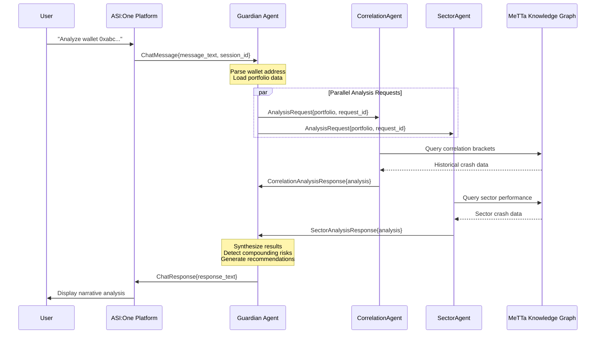

# API Specification

Guardian uses **uAgents Protocol** for all inter-agent communication. Unlike traditional REST APIs with HTTP endpoints, agents communicate via **asynchronous message-passing** using Pydantic-based message models. This section defines the message contracts that agents exchange.

**Communication Pattern:** All messages use the request-response pattern. Guardian sends analysis requests to specialized agents, which respond with analysis results. Agents discover each other via Agentverse addresses (agent1qw..., agent1qx..., etc.).

## uAgents Message Protocol

Guardian's message contracts are defined as Pydantic models that inherit from `Model` (uAgents base class). Each message type serves as a typed contract between sender and receiver.

### AnalysisRequest Message

**Sender:** Guardian → CorrelationAgent OR SectorAgent
**Purpose:** Request portfolio risk analysis from a specialized agent
**Response:** CorrelationAnalysisResponse OR SectorAnalysisResponse

```python
from uagents import Model
from typing import List
from datetime import datetime

class AnalysisRequest(Model):
    """
    Request message sent from Guardian to specialized agents requesting portfolio analysis.

    Both CorrelationAgent and SectorAgent accept this message type.
    """
    request_id: str  # Unique identifier for tracking request/response pairs
    wallet_address: str  # Ethereum wallet being analyzed
    portfolio: Portfolio  # Complete portfolio data (reuses Portfolio model from Data Models section)
    requested_by: str  # Agent address of requester (Guardian's address)

    # Example usage in Guardian:
    # await ctx.send(
    #     correlation_agent_address,
    #     AnalysisRequest(
    #         request_id="req_abc123",
    #         wallet_address="0x742d35Cc6634C0532925a3b844Bc9e7595f0bEb",
    #         portfolio=portfolio_data,
    #         requested_by=ctx.agent.address
    #     )
    # )
```

---

### CorrelationAnalysisResponse Message

**Sender:** CorrelationAgent → Guardian
**Purpose:** Return correlation analysis results including historical crash context
**Triggered By:** AnalysisRequest message

```python
class CorrelationAnalysisResponse(Model):
    """
    Response message from CorrelationAgent containing correlation analysis results.
    """
    request_id: str  # Matches the request_id from AnalysisRequest
    wallet_address: str  # Wallet that was analyzed
    analysis: CorrelationAnalysis  # Complete correlation analysis (reuses model from Data Models)
    agent_address: str  # CorrelationAgent's address for transparency
    processing_time_ms: int  # Time taken to compute analysis

    # Example response:
    # CorrelationAnalysisResponse(
    #     request_id="req_abc123",
    #     wallet_address="0x742d35Cc6634C0532925a3b844Bc9e7595f0bEb",
    #     analysis=CorrelationAnalysis(...),  # See Data Models section
    #     agent_address="agent1qw...",
    #     processing_time_ms=2847
    # )
```

---

### SectorAnalysisResponse Message

**Sender:** SectorAgent → Guardian
**Purpose:** Return sector concentration analysis including historical sector performance
**Triggered By:** AnalysisRequest message

```python
class SectorAnalysisResponse(Model):
    """
    Response message from SectorAgent containing sector concentration analysis.
    """
    request_id: str  # Matches the request_id from AnalysisRequest
    wallet_address: str  # Wallet that was analyzed
    analysis: SectorAnalysis  # Complete sector analysis (reuses model from Data Models)
    agent_address: str  # SectorAgent's address for transparency
    processing_time_ms: int  # Time taken to compute analysis
    unknown_tokens: List[str]  # Tokens not found in sector_mappings.json

    # Example response with unknown tokens:
    # SectorAnalysisResponse(
    #     request_id="req_abc123",
    #     wallet_address="0x742d35Cc6634C0532925a3b844Bc9e7595f0bEb",
    #     analysis=SectorAnalysis(...),
    #     agent_address="agent1qx...",
    #     processing_time_ms=1923,
    #     unknown_tokens=["OBSCURE_TOKEN"]  # Flagged for user awareness
    # )
```

---

### ChatMessage (ASI:One Chat Protocol)

**Sender:** User → Guardian (via ASI:One platform)
**Purpose:** User's natural language query requesting portfolio analysis
**Response:** ChatResponse

```python
class ChatMessage(Model):
    """
    Incoming message from ASI:One Chat Protocol containing user's natural language request.

    ASI:One platform handles the Chat Protocol implementation; Guardian receives this message.
    """
    user_id: str  # ASI:One user identifier (may be anonymous for hackathon)
    message_text: str  # User's natural language input (e.g., "Analyze wallet 0xabc...")
    session_id: str  # Conversation session identifier
    timestamp: datetime  # When user sent the message

    # Example incoming message:
    # ChatMessage(
    #     user_id="user_12345",
    #     message_text="Analyze my portfolio at 0x742d35Cc6634C0532925a3b844Bc9e7595f0bEb",
    #     session_id="session_xyz",
    #     timestamp=datetime.utcnow()
    # )
```

---

### ChatResponse (ASI:One Chat Protocol)

**Sender:** Guardian → User (via ASI:One platform)
**Purpose:** Guardian's narrative response containing synthesized portfolio analysis
**Triggered By:** ChatMessage

```python
class ChatResponse(Model):
    """
    Outgoing message to ASI:One Chat Protocol containing Guardian's analysis response.

    This is rendered as conversational text in ASI:One interface.
    """
    session_id: str  # Matches session_id from ChatMessage
    response_text: str  # Narrative analysis response (multi-paragraph plain text)
    response_type: str  # "analysis_complete" | "error" | "clarification_needed"
    metadata: dict  # Optional: agent addresses, processing time, risk level for debugging

    # Example response:
    # ChatResponse(
    #     session_id="session_xyz",
    #     response_text="""
    #     **Portfolio Risk Analysis for 0x742d35Cc...**
    #
    #     **Correlation Analysis (from CorrelationAgent):**
    #     Your portfolio is 95% correlated to ETH. Portfolios with >90% correlation lost...
    #
    #     **Sector Analysis (from SectorAgent):**
    #     68% of your portfolio is concentrated in DeFi Governance tokens...
    #
    #     **Guardian Synthesis:**
    #     Your 95% ETH correlation combined with 68% governance concentration creates...
    #
    #     **Recommendations:**
    #     1. Reduce DeFi Governance concentration from 68% to below 40%...
    #     """,
    #     response_type="analysis_complete",
    #     metadata={
    #         "correlation_agent": "agent1qw...",
    #         "sector_agent": "agent1qx...",
    #         "total_processing_ms": 5234,
    #         "overall_risk_level": "Critical"
    #     }
    # )
```

---

### ErrorMessage (Universal)

**Sender:** Any agent → Any agent
**Purpose:** Communicate errors, timeouts, or unavailable data
**Triggered By:** Failed request processing

```python
class ErrorMessage(Model):
    """
    Universal error message for communicating failures across agents.
    """
    request_id: str  # Matches original request
    error_type: str  # "timeout" | "invalid_data" | "insufficient_data" | "agent_unavailable"
    error_message: str  # Human-readable error explanation
    agent_address: str  # Address of agent that encountered the error
    retry_recommended: bool  # Whether requester should retry

    # Example error from CorrelationAgent:
    # ErrorMessage(
    #     request_id="req_abc123",
    #     error_type="insufficient_data",
    #     error_message="Token XYZ has insufficient historical price data for 90-day correlation calculation. Need at least 60 days, have only 15 days.",
    #     agent_address="agent1qw...",
    #     retry_recommended=False
    # )
```

---

## Message Flow Diagram



---

## Message Routing and Discovery

**Agent Discovery:** Agents discover each other via Agentverse registry using agent addresses:
- Guardian orchestrator: `agent1qy...` (example, actual address assigned at deployment)
- CorrelationAgent: `agent1qw...`
- SectorAgent: `agent1qx...`

**Address Configuration:** Agent addresses stored in environment variables:

```bash
# .env file
GUARDIAN_ADDRESS=agent1qy4mj8k2nqz...
CORRELATION_AGENT_ADDRESS=agent1qw9xth4kl2p...
SECTOR_AGENT_ADDRESS=agent1qx7bvc3mn8s...
```

**Message Handlers:** Each agent implements uAgents decorators for message handling:

```python
# Guardian agent message handler example
from uagents import Agent, Context

guardian = Agent(name="guardian", seed="guardian_seed")

@guardian.on_message(model=ChatMessage)
async def handle_chat_message(ctx: Context, sender: str, msg: ChatMessage):
    """Handle incoming chat messages from ASI:One."""
    # Parse wallet address from msg.message_text
    # Load portfolio data
    # Send AnalysisRequest to CorrelationAgent and SectorAgent
    # Wait for responses
    # Synthesize results
    # Send ChatResponse back
    pass

@guardian.on_message(model=CorrelationAnalysisResponse)
async def handle_correlation_response(ctx: Context, sender: str, msg: CorrelationAnalysisResponse):
    """Handle response from CorrelationAgent."""
    # Store correlation analysis
    # Check if sector response also received
    # If both complete, proceed to synthesis
    pass
```

---

## Timeout and Retry Policy

**Timeout Configuration:**
- Individual agent response timeout: **10 seconds**
- Total end-to-end analysis timeout: **60 seconds**

**Retry Policy:**
- **No automatic retries** for MVP (timeout = failure, return error to user)
- Post-MVP: Implement exponential backoff with max 2 retries

**Timeout Handling:**
```python
# Guardian timeout handling pseudocode
try:
    correlation_response = await ctx.wait_for_message(
        model=CorrelationAnalysisResponse,
        timeout=10.0  # 10 seconds
    )
except TimeoutError:
    # Log timeout, proceed with partial analysis
    correlation_response = None
    # Guardian can still provide sector analysis + note correlation unavailable
```

---
