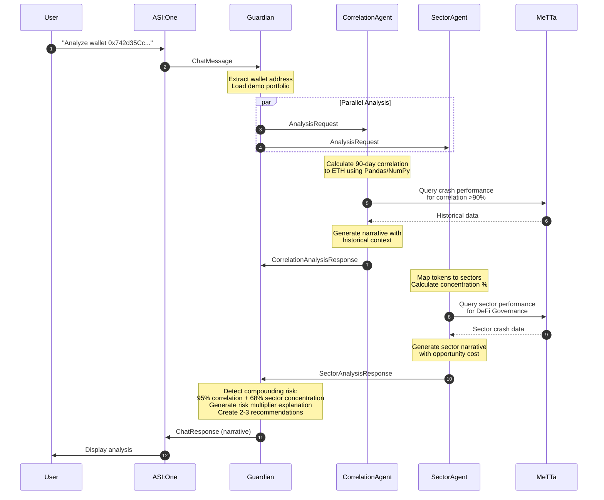

# Core Workflows

## End-to-End Portfolio Analysis Workflow

This sequence diagram shows the complete flow from user query to synthesized analysis:

**Key Decision Points:**
1. **Step 3:** If wallet address not found in demo_wallets.json, return error
2. **Steps 4-5:** Agents called in parallel to minimize latency
3. **Step 9:** If MeTTa unavailable, fall back to historical_crashes.json
4. **Step 15:** If MeTTa unavailable, fall back to JSON sector data
5. **Step 17:** Synthesis detects compounding risk if BOTH correlation >85% AND any sector >60%

---
