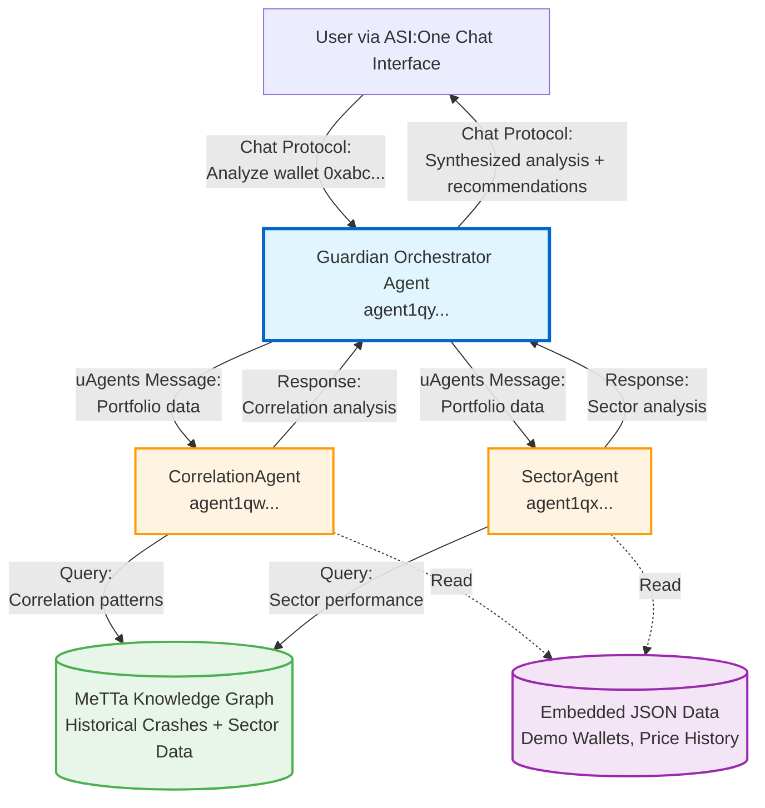

# High Level Architecture

## Technical Summary

Guardian employs a **distributed multi-agent architecture** built on the Fetch.ai uAgents framework, where three autonomous agents collaborate via asynchronous message-passing to deliver portfolio risk intelligence. The system architecture is fundamentally different from traditional web applications: instead of a monolithic backend serving a rich client frontend, Guardian consists of independent agents deployed to Agentverse that communicate through the uAgents protocol.

**Architectural Style:** Agent-Oriented Architecture (AOA) with message-passing communication
**Deployment Approach:** Serverless agent deployment on Agentverse platform (Fetch.ai managed infrastructure)
**Frontend Interface:** Conversational AI via ASI:One Chat Protocol (text-based, no traditional UI framework)
**Backend Technology:** Python 3.10+ using uAgents framework for agent implementation
**Key Integration Points:**
- ASI:One Chat Protocol bridges user input to Guardian orchestrator
- uAgents message protocol enables inter-agent communication (Guardian ↔ CorrelationAgent ↔ SectorAgent)
- Hyperon Python bindings connect agents to MeTTa knowledge graph for historical data queries

**Infrastructure Platform:** Agentverse (Fetch.ai)—managed platform for agent hosting, discovery, and communication

**Alignment with PRD Goals:** This architecture achieves hackathon objectives by demonstrating true multi-agent collaboration (visible, transparent agent interactions), leveraging ASI Alliance technologies (uAgents, MeTTa), and providing conversational intelligence rather than static dashboards. The distributed agent design allows each specialized agent to evolve independently post-hackathon while maintaining clear separation of concerns.

## Platform and Infrastructure Choice

**Context:** Given the ASI Alliance Hackathon constraints, platform selection is predetermined. However, understanding the trade-offs clarifies why this architecture is designed the way it is.

**Platform:** Agentverse (Fetch.ai)

**Key Services:**
- **Agent Hosting:** Continuous agent runtime environment (agents run 24/7 listening for messages)
- **Agent Discovery:** Public agent addresses (agent1qw...) for inter-agent communication
- **Message Routing:** uAgents protocol handles message delivery between agents
- **Monitoring:** Built-in agent health monitoring and logging via Agentverse dashboard

**Deployment Host and Regions:** Agentverse global infrastructure (managed by Fetch.ai, specific regions not controllable by developers)

**Alternative Considered (Hypothetical):**

While not applicable for this hackathon, here's what a traditional architecture comparison would look like:

| Aspect | Agentverse (Chosen) | AWS Full Stack (Alternative) |
|--------|---------------------|------------------------------|
| **Pros** | Zero infrastructure management, native multi-agent support, hackathon required | Full control, mature ecosystem, comprehensive services |
| **Cons** | Limited customization, emerging platform, vendor lock-in | Complex setup, infrastructure overhead, not hackathon eligible |
| **Fit** | Perfect for hackathon, demonstrates bleeding-edge tech | Production-grade but misses hackathon requirements |

**Recommendation:** Agentverse is the only viable choice given hackathon requirements. Post-hackathon, a hybrid approach could deploy critical agents on AWS Lambda while maintaining Agentverse for agent discovery and ASI ecosystem integration.

## Repository Structure

**Structure:** Monorepo (single repository containing all agents, shared code, data, tests, and documentation)

**Monorepo Tool:** Manual organization (no Nx, Turborepo, or Lerna)—Python's native module system handles code sharing via relative imports

**Package Organization:**

```
guardian/
├── agents/                      # Agent implementations
│   ├── guardian.py              # Main orchestrator agent
│   ├── correlation_agent.py     # Correlation analysis specialist
│   ├── sector_agent.py          # Sector concentration specialist
│   └── shared/                  # Shared utilities across agents
│       ├── __init__.py
│       ├── metta_interface.py   # MeTTa query abstraction layer
│       ├── portfolio_utils.py   # Portfolio parsing and data structures
│       └── config.py            # Shared configuration
├── data/                        # Data files embedded with agents
│   ├── demo_wallets.json        # Pre-configured demo portfolios
│   ├── historical_crashes.json  # Market crash scenario data
│   ├── sector_mappings.json     # Token-to-sector classifications
│   └── metta_knowledge/         # MeTTa knowledge graph files (.metta)
├── tests/                       # Test suite
│   ├── __init__.py
│   ├── test_agents.py           # Unit tests for agent logic
│   ├── test_integration.py      # Inter-agent communication tests
│   └── test_metta_queries.py    # MeTTa query accuracy validation
├── docs/                        # Documentation
│   ├── README.md                # Main project documentation
│   ├── prd.md                   # Product requirements (existing)
│   ├── architecture.md          # This document
│   ├── DEMO.md                  # Demo instructions for judges
│   └── sample-responses/        # Expected agent responses for demo wallets
├── scripts/                     # Deployment and utility scripts
│   └── deploy_agents.sh         # Agent deployment automation
├── .env.example                 # Environment variable template
├── .gitignore                   # Git ignore patterns
├── requirements.txt             # Python dependencies (pinned versions)
└── README.md                    # Root readme (duplicates docs/README.md)
```

**Rationale:**
- **Simplicity over tooling:** For a 10-day hackathon with 3 agents, heavyweight monorepo tools add complexity without benefit
- **Shared code via Python imports:** `from agents.shared.portfolio_utils import parse_portfolio` works natively
- **Atomic commits:** Changes affecting multiple agents (e.g., updating MeTTa interface) committed together
- **Judge accessibility:** Single GitHub URL, all code visible in one place, easy to review

## High Level Architecture Diagram



## Architectural Patterns

Guardian leverages multiple architectural patterns across different system layers to balance hackathon constraints (speed, solo developer) with production-quality design principles:

- **Agent-Oriented Architecture (AOA):** Autonomous agents with independent logic and data, collaborating via messages rather than shared state or direct function calls. _Rationale:_ Enables independent agent evolution, natural distribution, and demonstrates true multi-agent intelligence (core hackathon requirement).

- **Message-Passing Concurrency:** Asynchronous communication between agents using uAgents protocol instead of synchronous HTTP requests. _Rationale:_ Decouples agent lifecycles, enables parallel analysis (CorrelationAgent and SectorAgent can work simultaneously), and aligns with actor model best practices.

- **Orchestrator Pattern:** Guardian acts as central coordinator receiving user input, delegating to specialized agents, and synthesizing results. _Rationale:_ Provides single entry point for users, encapsulates multi-agent complexity, and creates clear responsibility separation (orchestration vs. analysis logic).

- **Knowledge Graph Integration:** MeTTa serves as semantic data store for historical crash scenarios and sector relationships. _Rationale:_ Demonstrates SingularityNET technology (hackathon requirement), enables rich queries ("find crashes where correlation >90% AND sector concentration >60%"), and separates domain knowledge from agent code.

- **Conversational Interface Pattern:** Natural language interaction via ASI:One Chat Protocol instead of REST APIs or web forms. _Rationale:_ Lowers user barrier (no wallet connection needed), creates narrative experience (progressive revelation), and showcases agent intelligence rather than UI polish.

- **Embedded Data Pattern:** JSON files and MeTTa knowledge graphs deployed alongside agents rather than external databases. _Rationale:_ Zero infrastructure management, deterministic demo behavior (no API rate limits), fast iteration during hackathon, suitable for read-only analysis use case.

- **Stateless Agents (MVP):** Each analysis request is independent with no session persistence between queries. _Rationale:_ Simplifies agent implementation, avoids state synchronization complexity, acceptable for hackathon demos (post-MVP can add conversation context).

- **Transparent Multi-Agent Collaboration:** Individual agent responses visible to users, not hidden in backend processing. _Rationale:_ Builds trust in analysis, demonstrates multi-agent value to judges, and provides educational transparency showing how specialized intelligence combines.

---
